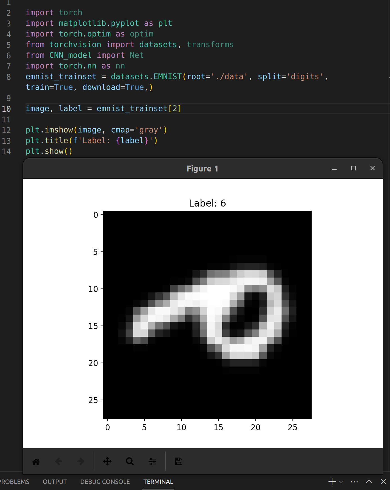

# CNN EMNIST documentation

## How to run:

```
python3 inference.py --input /test/data
```
Works with docker

To train model simply type
```
python3 train.py
```

Files:
```
train.py - training script
```
```
model.plt - binary file that stores model
```
```
inference.py - CLI program to test model
```
```
CNN.py - model code itself
```
# Workflow:
## Data:

After doing some research  I found [EMNIST](https://www.nist.gov/itl/products-and-services/emnist-dataset) contains both numbers and letters(280,000 digits, 145,600 letters) and also it is in default Pytorch datasets, we can import it as

```python
from torchvision import datasets, transforms
```

When I was observing the dataset I found that each image is transposed:


To fix it I need to transpose it back using pytorch transform module with dataset:


Great!

(I will also normalize them after transpose using transforms.Normalize((0.1307,), (0.3081,)))

Let’s merge images and letters and also we need to fix labels for letters(Which start from 0)

```python
# for chars offset is 10(last digit label is 9)
letter_target__transform = transforms.Compose([    
    transforms.Lambda(lambda y: y + 9)
])
```

So we have following labels: digits 0-9 letters 10-36

Merge two datasets:

```python
trainset = torch.utils.data.ConcatDataset([emnist_trainset, emnist_letters_trainset])
testset = torch.utils.data.ConcatDataset([emnist_testset, emnist_letters_testset])
```

## Architecture

Because dataset is not large(425600) CNNs look right also they are industry standard, easy to use and implement. Other alternative which I know, could be: ViT(Visual Transformer) but they need a lot of data.

For this simple task I don’t need complicate architecture, 2 layers with max pools should be enough. Also Batch Normalization and Dropout used as regularization. Dropout value of 0.28 was chosen from my past research.

Among all optimizers AdamW seems to be the best in this situation, as you will see later.

## Runs:

All runs are logged to wandb for further researching. 

### Run 1(arbitrary parameters)

Parameters:

```python
batch_size = 64
lr = 0.0001
epochs = 5
optimizer = optim.AdamW(model.parameters(), lr=lr, weight_decay=0.1)
```

Architecture:

```python
self.layer1 = nn.Sequential(
    nn.Conv2d(1, 32, kernel_size=5),
    nn.ReLU(),
    nn.BatchNorm2d(32),
    nn.Dropout(0.28),
    nn.MaxPool2d(kernel_size=2),
    )

self.layer2 = nn.Sequential(
    nn.Conv2d(32, 64, kernel_size=5),
    nn.ReLU(),
    nn.BatchNorm2d(64),
    nn.Dropout(0.28),
    nn.MaxPool2d(kernel_size=2))
self.fc1 = nn.Linear(4 * 4 * 64, 37)
```


**Results:**

Accuracy 91%

I see that weights initialization are bad, let’s fix it.

The best initialization is Xavier:

```python
for layer in self.modules():
            if isinstance(layer, nn.Conv2d) or isinstance(layer, nn.Linear):
                init.xavier_uniform_(layer.weight)
```

Also adding warmup stage is reasonable, I think:

```python
#Warmup stage
warmup_lr = 0.00001
warmup_optimizer = optim.AdamW(model.parameters(), lr=warmup_lr, weight_decay=0.1)
for batch_idx, (data, target) in enumerate(train_loader):
        data, target = data.to(device), target.to(device)
        warmup_optimizer.zero_grad()
        output = model(data)
        loss = nn.functional.nll_loss(output, target)
        loss.backward()
        warmup_optimizer.step()
        if batch_idx > num_warmup_iters:
            break
            
        if batch_idx % 100 == 0:
            print('Warmup: [{}/{} ({:.0f}%)]\tLoss: {:.6f}'.format(
                batch_idx * len(data), len(train_loader.dataset),
                100. * batch_idx / len(train_loader), loss.item()))
```

### Run 2

Parameters:

```python
batch_size = 64
lr = 0.0001
epochs = 5
num_warmup_iters = 200
optimizer = optim.AdamW(model.parameters(), lr=lr, weight_decay=0.1)
```


**Results:**

Average loss: 0.2432

Accuracy 92%

Val/loss now converges better, but still no big improvements in accuracy. Maybe AdamW is overwhelming, let’s find out which optimizer is the best here and also fix bug in val/los visualization(which has incorrect axis numbers in wandb). And also let’s increase batch_size to 128, warmup iters increase to 500 

### Run 3-6

Parameters:

```python
batch_size = 128
lr = 0.0001
num_warmup_iters = 500
epochs = 5
#Run 3-4
weight_decay = 0.0001
#Run 3
optimizer = optim.SGD(model.parameters(), lr=lr, weight_decay=weight_decay,momentum = 0.9)
#Run 4
optimizer = optim.Adagrad(model.parameters(), lr=lr, weight_decay=weight_decay)
#Run 5
optimizer = optim.Adam(model.parameters(), lr=warmup_lr, weight_decay=weight_decay)
#Run 6
optimizer = optim.AdamW(model.parameters(), lr=warmup_lr, weight_decay=weight_decay)
```


                           SGD 
                     Accuracy 87%


                        Adagrad        
                    Accuracy 71%


                        Adam
                  Accuracy 90%


                           AdamW
                        Accuracy 91%

So as we see, AdamW performs the best 91% accuracy and I will use it in next runs.

### Run 7-9
Let’s research other hyperparameters of model, I tried different architectures:

1.

```python
self.layer1 = nn.Sequential(
            nn.Conv2d(1, 32, kernel_size=5),
            nn.ReLU(),
            nn.Conv2d(32, 32, kernel_size=5),
            nn.ReLU(),
            nn.BatchNorm2d(32),
            nn.MaxPool2d(kernel_size=2),
            nn.Dropout(0.28),
        )

        self.layer2 = nn.Sequential(
            nn.Conv2d(32, 64, kernel_size=5),
            nn.ReLU(),
            nn.Conv2d(64, 64, kernel_size=5),
            nn.ReLU(),
            nn.BatchNorm2d(64),
            nn.MaxPool2d(kernel_size=2),
            nn.Dropout(0.28),
        )

        self.fc1 = nn.Sequential(
            nn.Linear(64, 4 * 4 * 64),
            nn.BatchNorm1d(4 * 4 * 64),
            nn.ReLU(),
            nn.Dropout(0.28),
        )
        self.fc2 = nn.Linear(4 * 4 * 64, 37)
```

93% accuracy a bit of improvement, let’s decrease batch_size back to 64 and add more layers

---

2.

```python
self.layer1 = nn.Sequential(
            nn.Conv2d(1, 32, kernel_size=5),
            nn.ReLU(),
            nn.Conv2d(32, 32, kernel_size=5),
            nn.ReLU(),
            nn.BatchNorm2d(32),
            nn.MaxPool2d(kernel_size=2),
            nn.BatchNorm2d(32),
            nn.Dropout(0.28),
        )

        self.layer2 = nn.Sequential(
            nn.Conv2d(32, 64, kernel_size=5),
            nn.ReLU(),
            nn.Conv2d(64, 64, kernel_size=5),
            nn.ReLU(),
            nn.BatchNorm2d(64),
            nn.MaxPool2d(kernel_size=2),
            nn.BatchNorm2d(64),
            nn.Dropout(0.28),
        )

        self.fc1 = nn.Sequential(
            nn.Linear(64, 4 * 4 * 64),
            nn.ReLU(),
            nn.BatchNorm1d(4 * 4 * 64),
            nn.Linear(4 * 4 * 64, 4 * 4 * 64),
            nn.ReLU(),
            nn.BatchNorm1d(4 * 4 * 64),
            nn.Dropout(0.28),
        )
        self.fc2 = nn.Linear(4 * 4 * 64, 37)
```

There are no sense in adding more conv layers, tests show that it doesn’t change anything, in my opinion this is because of simple nature of dataset, we have not so many patterns in numbers and letters for network to discover.

94% Accuracy! With 0.206 val los


Let’s give it more epochs and time and see the final results

After 30 Epochs accuracy is 96% with 0.18623 val los, good result!

I don't have time for further training because it's very time-consuming, so should stop with these results.

Funny thing is that it confuses 1, L, J as well as 0, Q, O and 9, q, g for obvious reasons, in some cases they are almost identical. And that's why it cannot perform 98-99% accuracy. 

Also, it performs poorly when images are smaller then 28x28, but ok if bigger. I guess this is becouse of less information on smaller pictures.

Thanks for reading my small research.
# About Author:
Hi! I'm Andrii from Uzhhorod. I'm excited about machine learning, I love to read and talk about it! I'm participating in an AI reading club where I even few times have an opportunity to present my projects. But also I have commercial expirience in software development, in past I worked as .NET and SQL developer for 2 years.  I'm highly motivated in learning AI. Also, I love Linux, Networking, DevOps, math, Python and stats.

[LinkedIn](https://www.linkedin.com/in/andrii-hladkyi-ml/)
[GitHub](https://github.com/andrewgll)
[resume](https://andrewwww.notion.site/Andrii-Hladkyi-a5700c46ba4e47cf8f7f8334faf10491)
mail: andrii.hladkyi.teacher@gmail.com
phone: +380989769167